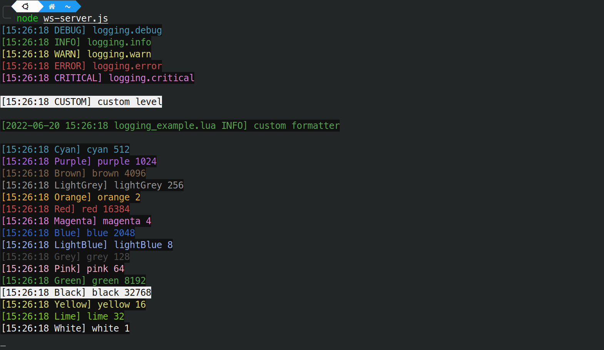
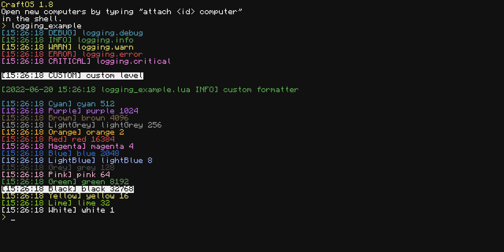

# CC-Logging

[](https://github.com/Commandcracker/CC-Logging/actions/workflows/pages.yml)

An logging library for Computer Craft

**WARNING: Please Do not use CC-Logging in production, because it's currently in development!**

- **All Handler's will be reworked.**
- **Some classes will be renamed.**
- **Log levels will completely be overhauled.**

## Example

look at the [Documentation](https://commandcracker.github.io/CC-Logging/) for moor help and please remind that the documentation is incomplete.

```lua
local logging = dofile("logging.lua")
local logger = logging.Logger.new(shell.getRunningProgram())

logger:debug("debug message")
logger:info("info message")
logger:warn("warn message")
logger:error("error message")
logger:critical("critical message")
```

## Custom Handler

```lua
local logging = require("logging")
local logger  = logging.Logger.new(shell.getRunningProgram())

local CustomHandler = {}

function CustomHandler.new(formatter)
    local instance     = setmetatable({}, { __index = CustomHandler })
    instance.formatter = formatter
    return instance
end

function CustomHandler:handle(record)
    local old_text_colour       = term.getTextColor()
    local old_background_colour = term.getBackgroundColor()

    term.setTextColor(record.level.textcolor)
    term.setBackgroundColor(record.level.backgroundcolor)

    -- example functionality: reverse every message
    record.message = string.reverse(record.message)
    write(self.formatter:format(record))

    term.setTextColor(old_text_colour)
    term.setBackgroundColor(old_background_colour)

    write("\n")
end

logger:addHandler(CustomHandler.new(logger.formatter))

logger:info("Message Handeld by Custom Handler")
```

## Websocket Example

### Server



```js
const WebSocket = require('ws');
const server = new WebSocket.Server({
    port: 8080
});

let sockets = [];

server.on('connection', function (socket) {
    sockets.push(socket);

    // When you receive a message, log it
    socket.on('message', function (msg) {
        console.log(msg.toString());
    });

    // When a socket closes, or disconnects, remove it from the array.
    socket.on('close', function () {
        sockets = sockets.filter(s => s !== socket);
    });
});
```

### Client



```lua
local logging          = require("logging")
local logger           = logging.Logger.new(shell.getRunningProgram())
local websocket        = http.websocket("ws://127.0.0.1:8080")
local websocketHandler = logging.ColordWebsocketHandler.new(logger.formatter, websocket)
logger:addHandler(websocketHandler)

logger:debug("logging.debug")
logger:info("logging.info")
logger:warn("logging.warn")
logger:error("logging.error")
logger:critical("logging.critical")

local function blankLine()
    websocket.send(" ")
    print()
end

blankLine()

local level = logging.Level.new("CUSTOM", nil, colours.black, colours.white)
logger:log(level, "custom level")

blankLine()

local formatter               = logging.Formatter.new("[%(time) %(name) %(levelname)] %(message)", "%Y-%m-%d %H:%M:%S")
local custom_logger           = logging.Logger.new(shell.getRunningProgram(), nil, formatter)
local custom_websocketHandler = logging.ColordWebsocketHandler.new(formatter, websocket)
custom_logger:addHandler(custom_websocketHandler)

custom_logger:info("custom formatter")

blankLine()

for k, v in pairs(colours) do
    if type(v) == "number" then
        local _level
        if v == colours.black then
            _level = logging.Level.new(k:gsub("^%l", k.upper), 20, v, colours.white)
        else
            _level = logging.Level.new(k:gsub("^%l", k.upper), 20, v, colours.black)
        end
        logger:log(_level, k, v)
    end
end

websocket.close()
```
